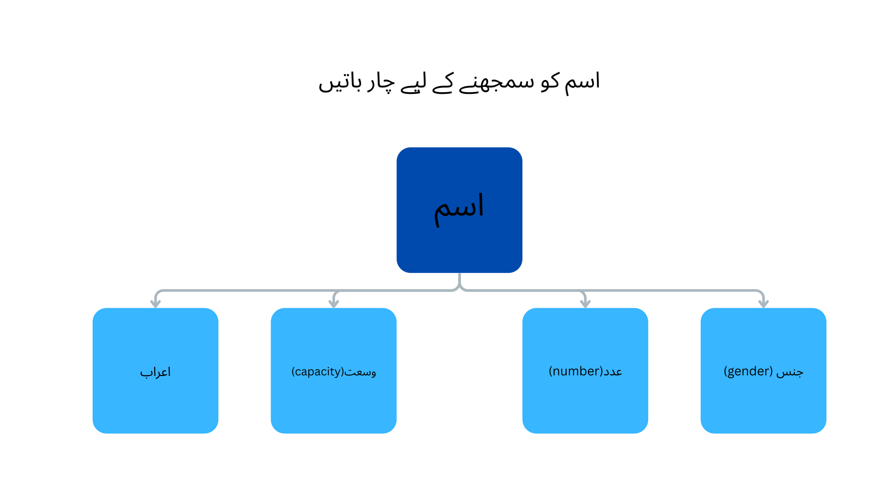

# Learning More about Nouns

In the name of Allah, the most beneficent, the most merciful

----

My Lord! Open my heart, and make my task easy for me, loosen the knot in my tongue, so that they may understand my speech.

O Allah, I ask You for beneficial knowledge, goodly provision, and acceptable deeds.

----

**Disclaimer: We are biggners in learning arabic. Also, we are managing the the publishing of our journey along with our other activities. Hence, the content will be full of mistakes. Please do not use the content as it is, and do your own research. May Allah protect us from saying anything that we should not. May Allah protect us and the audiance from the "Shar" of what we said or what we did not**

## Understanding Noun, it's attributes

In this we started understanding 4 attributes of noun:
- Gender
- Number(s)
- Capacity
- Araab (اعراب)

[lecture](https://www.youtube.com/watch?v=UCyEe5WhclY&list=PLmcMQH9TZ96CW1JtrdxoYJhcaJ_oPkU5c&index=2&pp=iAQB0gcJCY0JAYcqIYzv)

## Understanding Gender types and recognition rule

In this we learned Gender types and how to majorly identify males / females nouns in Arabic including the nouns that do not have any real gender like books, home, sun, etc

[lecture](https://www.youtube.com/watch?v=yRwwgPW9R30&list=PLmcMQH9TZ96CW1JtrdxoYJhcaJ_oPkU5c&index=3&pp=iAQB)

## Getting started with reshaping noun based on numbers

We have also started exploring three different shaps of noun that dipict either of following
- Singular
- Dual
- Plural

[lecture](https://www.youtube.com/watch?v=FqaRRa4sJPc&list=PLmcMQH9TZ96CW1JtrdxoYJhcaJ_oPkU5c&index=4&pp=iAQB)