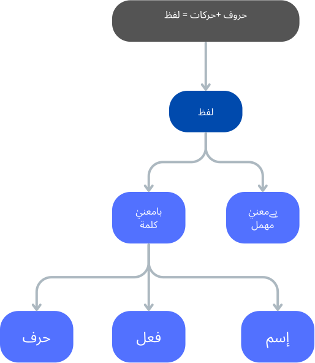

# Getting Started with Lisan-ul-Quran Course

In the name of Allah, the most beneficent, the most merciful

----

My Lord! Open my heart, and make my task easy for me, loosen the knot in my tongue, so that they may understand my speech.

O Allah, I ask You for beneficial knowledge, goodly provision, and acceptable deeds.

----

**Note: We are starting our notes from Week 17 (It's not our week 17. However, I roughly believe something like this can be started after ~4 months for kids above the age of 8). Because, we did not document our activities prior to this. We cannot also recommend any sources because we never used or followed any proper curiculum so far. Though, In Sha Allah, we will Document different sources that were useful prior to this.**

**Disclaimer: We are biggners in learning arabic. Also, we are managing the the publishing of our journey within along with our other activities. Hence, the content will be full of mistakes. Please do not use the content as it is, and do your own research. May Allah protect us from saying anything that we should not. May Allah protect us and the audiance from the "Shar" of what we said or what we did not**

## Important: Do not start with Grammer

Language Grammer cannot be a starting point for learning any languages.

By Allah's mercy every one of us has learned our native language by going through the following natural process
- speak commonly used words by elders
- commonly used short sentences we require to convey our messages
- Making our own new sentences 
- Learn from our mistakes and feedback from others

Through Allah's help, consciously and unconsciously we go through this cycle over and over again to start proper conversations in our native language. 

Hence, our method of learning any language should be similar too. We can utilize modern-day tools and techniques that can assist in speading up the process. Also, once we have learned a couple of languages then learning more will naturally become eaiser.

## Brief Context

Allah helped us take the step to learn Arabic collectively as family. All five of us are at a different stage of learning Arabic. Sixth one is too young - May Allah give us the capability to include him in the journy really early on)

However, just recently we decided to start the [Lisan-ul-Quran](https://www.youtube.com/playlist?list=PLmcMQH9TZ96CW1JtrdxoYJhcaJ_oPkU5c) course by Amir Sohail

We ended up starting with 2022 edition. If Allah wills, we may switch to [2024 edition]((https://www.youtube.com/playlist?list=PLmcMQH9TZ96ADVttN0f-l1eX5J9tFwaCm)) though

So far, we have been using following methods:
- Quran Qaida (For Kids)
- Quran Recitation
- Learning basic Arabic vocubulary through different sources
- Learning word-by-word translation of few Quranic Surah, Namaz, Duas, etc

## This week's lesson

The first lesson was about the introduction(تعارف) and Arabic Characters (حروف الھجاء). We skipped those as (Alhamdulillah) we were all familier with those. 

Few of the things that we took note of included while going through the first lecture and first few minutes of the second lecture are demonstrated in the below diagram

